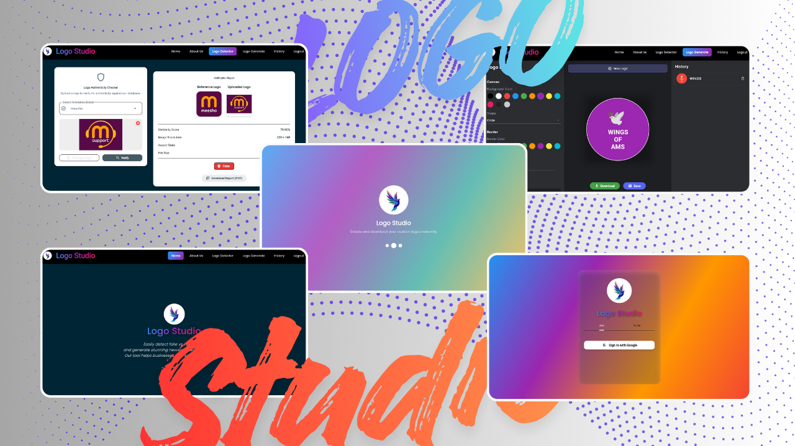

# 📌 Logo Studio 
### *AI-Assisted Design & Authenticity Verification Ecosystem*

  

---

## ⚡ Quick Navigation
**[🚀 Explore Live Demo](https://syed2006-hub.github.io/logo_studio_app/)**  

---

## 📖 **Project Concept**
**Logo Studio** is a next-generation MVP designed for the modern creator economy. Inspired by industry leaders like Canva, it bridges the gap between **creative design** and **brand protection**. 

Beyond just a "builder," this platform utilizes a **pixel-matching algorithm** to verify logo authenticity—ensuring your brand remains unique in a crowded digital space.

---

## 🛠 **Core Capabilities**

### 🎨 **Professional Design Suite**
* **Intuitive Canvas:** A fluid, drag-and-drop editor for real-time logo iteration.
* **High-Fidelity Exports:** Download production-ready assets instantly.
* **State Persistence:** Close your tab and return to your design exactly where you left it.

### 🔐 **Identity & Cloud Sync**
* **Google Auth Integration:** Secure, one-tap login for a personalized experience.
* **Cloudinary Storage:** High-speed image hosting ensuring your assets are always available.
* **Design History:** A chronological archive of every logo you've ever created.

### 🕵️ **Brand Authenticity (Verification Engine)**
* **Pixel-Match Tech:** Proprietary algorithm to compare logos for originality.
* **Fraud Detection:** Differentiates between authentic brand marks and potential clones.
* **Brand Protection:** Essential for startups looking to trademark their identity.

---

## 📊 **Intelligent Admin Insights**
The platform includes a robust **Analytics Dashboard** to drive product-led growth:
* **User Tracking:** Monitor active sessions and retention rates.
* **Heatmap Logic:** Identify which design features are the most popular.
* **Feedback Loop:** Centralized management of user reviews and feature requests.

---

## 🧬 **Technical Infrastructure**

| Component | Technology | Role |
| :--- | :--- | :--- |
| **Framework** | **Flutter (Web)** | Cross-platform UI consistency |
| **Auth** | **Firebase Authentication** | Secure user identity management |
| **Database** | **Firestore** | Real-time data sync & history |
| **Media** | **Cloudinary** | Optimized asset storage & delivery |
| **Logic** | **Pixel Matching Algo** | Image intelligence & verification |

---

## 🎯 **Target Audience**
* **Startups:** Rapidly prototyping brand identities.
* **Freelancers:** Managing multiple client logo projects in one hub.
* **Legal Teams:** Verifying logo originality for trademarking.
* **Product Managers:** Using the analytics to understand creative workflows.

---

## 📌 **Development Roadmap**
- [x] **Phase 1:** Core Canvas Engine & Firebase Sync
- [x] **Phase 2:** Authenticity Verification Algorithm
- [ ] **Phase 3:** AI-Powered Auto-Logo Suggestions (Coming Soon)
- [ ] **Phase 4:** Multi-Format Vector Export (SVG/EPS)

---

  <i>Developed by <b>Syed</b></i>  
  <b>Build • Verify • Scale</b>

